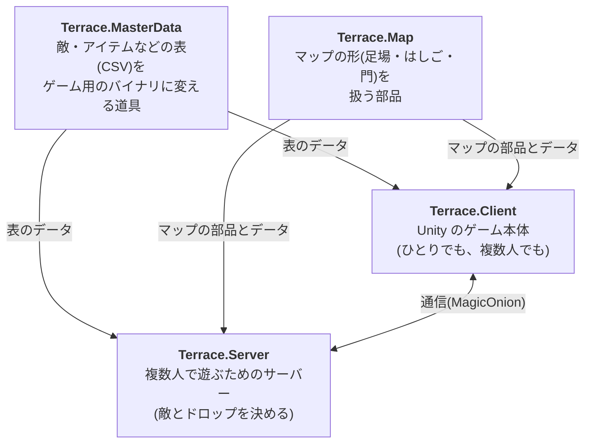

# Terrace の概要

> この文書は人間が読むための概要です。細かい仕様は AI 向けの文書(`docs/` の他のファイル)にまとめてあります。
> 図は Mermaid で書いています。GitHub ではそのまま絵になり、VS Code では Mermaid 対応の拡張機能を入れると見られます。

## Terrace とは

**メイプルストーリーを手本にした、2D 横スクロールの MORPG** です。

坂道や段差のある足場を歩き、はしごやロープを登り、門をくぐって町と狩場を行き来し、敵を倒してアイテムを拾い、町の店で売り買いする。そうした遊びを、あとで複数人が同じマップで遊べる形へ広げていくことを目指しています。

開発は主に AI(Claude など)に指示を出して進めています。そのため文書は、AI が迷わず読めることを第一に書いています。

## いま遊べること

Unity のクライアントで次のことができます。**ひとりでも、サーバーにつないで複数人でも**遊べます。

- 左右に歩く、跳ぶ、しゃがむ、坂道を上り下りする、崖から落ちる、下の足場へ飛び降りる
- はしごとロープを登り降りする
- 門(ポータル)をくぐって、**テラスの町**・**草原**・**砂の崖**の 3 枚を行き来する
- 敵(スライム・ゴブリン・ゴースト)を攻撃して倒す。倒した敵はしばらくすると復活する
- 敵が落としたアイテムを拾う。倒すとメソ(お金)が入る
- 敵に触れるとダメージを受けて吹き飛ぶ。HP が尽きると出現地点で復活する
- 町の NPC をクリックして店を開き、アイテムを売り買いする
- 複数人で同じマップに入り、互いの姿(名札つき)を見ながら同じ敵を倒す。落とし物は早い者勝ち
- 町の NPC に話しかけ、店でアイテムを買ったり売ったりする

見た目は Kenney のフリー素材(CC0)を使っています。

サーバーは別に作ってあり、テスト用のコンソールクライアントを複数つなぐと、移動が互いに流れ、敵へのダメージや撃破・ドロップ・復活が全員に届くところまで動きます。**Unity のクライアントとサーバーはまだつないでいません。**

## 全体の構成

1 つのリポジトリの中の、4 つのプロジェクトでできています。

| プロジェクト | ひとことで | 使っている技術 |
|---|---|---|
| Terrace.MasterData | 表データの変換。エラーを「どのファイルの何行目」まで教えてくれる | .NET 10、MasterMemory |
| Terrace.Map | マップの部品。足場の繋がりの間違いを自動で見つける | .NET 10(Unity でも動く書き方) |
| Terrace.Server | ゲームサーバー | ASP.NET Core、MagicOnion |
| Terrace.Client | ゲーム本体 | Unity 6000.3 |

この 4 つを並べたフォルダ(`Terrace/`)に、全体の文書を置いています。

## 設計の大事な考え方

### 1. マップは「線のつながり」で表す

マス目(タイル)ではなく、足場を**線分**で表し、線分の端どうしをつなげます。つながりが無い端は崖になります。坂道がなめらかで、メイプルストーリーらしい「崖から歩き出すと落ちる」「下の足場へ飛び降りる」が素直に作れます。

### 2. 誰が決めるかを分ける

- **自分の移動は、自分のクライアントが決める。** 通信の遅れで操作がもたつかないように
- **敵の HP・撃破・復活・ドロップは、サーバーが決める。** みんなで同じ敵を見ているので、食い違わないように

### 3. ゲームのルールは Unity やサーバーの仕組みから切り離す

ゲームのルールは、Unity にもサーバーの通信にも依存しない普通の C# で書いています。そのため、Unity を開かなくても自動テストで素早く確かめられます。

クライアントは先にオフラインで遊べる形を作り、サーバーの役割を「ローカルの世界」が代わりに務めるようにしました。サーバーにつないだときは、そこをサーバーからの知らせで動かします。途中で回線が切れても、その場でひとり遊びに切り替わって続けられます。

### 4. 共有する部品はコピーで配る

マップの部品や表の定義はクライアントとサーバーの両方で使います。Unity でもそのまま動くように少し古い C# の書き方に留め、Unity へはスクリプトでコピーしています。

## 開発の進め方

AI に実装を任せ、人間は「何を作るか決める」と「出来上がりを見てマージする」に集中する形です。AI 向けの詳しい手順は [guides/task-workflow.md](guides/task-workflow.md) にあります。

1. **候補を出す。** GitHub の Issue を「候補」のフォームで立てます。AI との会話で「こういうのが欲しい」と話せば、AI が候補を立てることもできます
2. **仕様を詰める。** AI に「#12 をタスクにして」と頼みます。AI が決めるべきことを質問してくるので答えます。決まると、その Issue が「タスク」に書き換わります
3. **実装を頼む。** 新しい AI のセッションで「#12 を実装して」と頼みます。AI はタスク専用の作業場(`Terrace-wt/12`)で実装し、自動の検証を回し、PR を作ったところで止まります。別々のタスクを別々のセッションに頼めば、並列に進みます
4. **見てマージする。** PR では次を見ます
   - 自動の検証(CI)が通っているか
   - 本文の「検証」の表がすべて ok か(Unity の試験はここに載ります)
   - 「見てほしい所」に書かれたこと
   - 手で遊ぶ必要があるタスクなら、Unity Hub で `Terrace-wt/12/Terrace.Client` を開いて遊ぶ(初回は取り込みに数分かかります)

   良ければマージします。直してほしいときは PR にコメントを書き、AI に「PR のコメントに対応して」と頼みます
5. **片付ける。** マージの後、AI に「#12 を片付けて」と頼むと、作業場とブランチが消えます

同じ所を触るタスク(通信の定義など)は、並列にせず順番に頼みます。どのタスクがどこを触るかは、タスクの Issue に書いてあります。

## 開発の進み具合

| 段階 | 内容 | 状態 |
|---|---|---|
| 0 | 表データの道具・マップの部品・サーバーの土台を作る | 済み |
| 1 | Unity でひとりで遊べるようにする | 済み |
| 1.5 | 見た目を整え、町・NPC・店・2 枚目の狩場を足す | 済み |
| 2 | サーバーがマップと表データを読んで敵を動かす | 済み |
| 3 | Unity のクライアントとサーバーをつなぎ、複数人で遊べるようにする | 済み |
| 3.5 | 複数の AI に並列で実装させる流れ(Issue、作業場、自動の検証) | 済み |
| その先 | アイテムの使用と装備、経験値とレベル、スキル、ログインとセーブ | これから |

まだ決めていないことや、見つかっている食い違いは [roadmap.md](roadmap.md) にまとめています。

## 文書の地図

| 知りたいこと | 文書 |
|---|---|
| 次に何をするか、何が決まっていないか | [roadmap.md](roadmap.md) |
| 言葉の意味 | [glossary.md](glossary.md) |
| なぜこの作りにしたか | [decisions/](decisions/README.md) |
| 環境の作り方 | [guides/setup.md](guides/setup.md) |
| 遊び方・操作 | `Terrace.Client/README.md` |
| AI 向けの文書の目次 | [README.md](README.md) |
