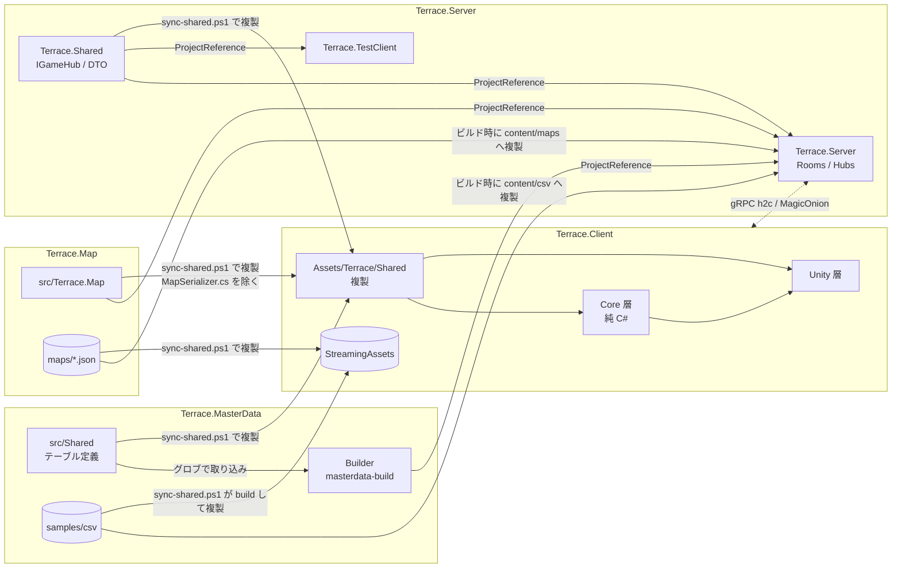
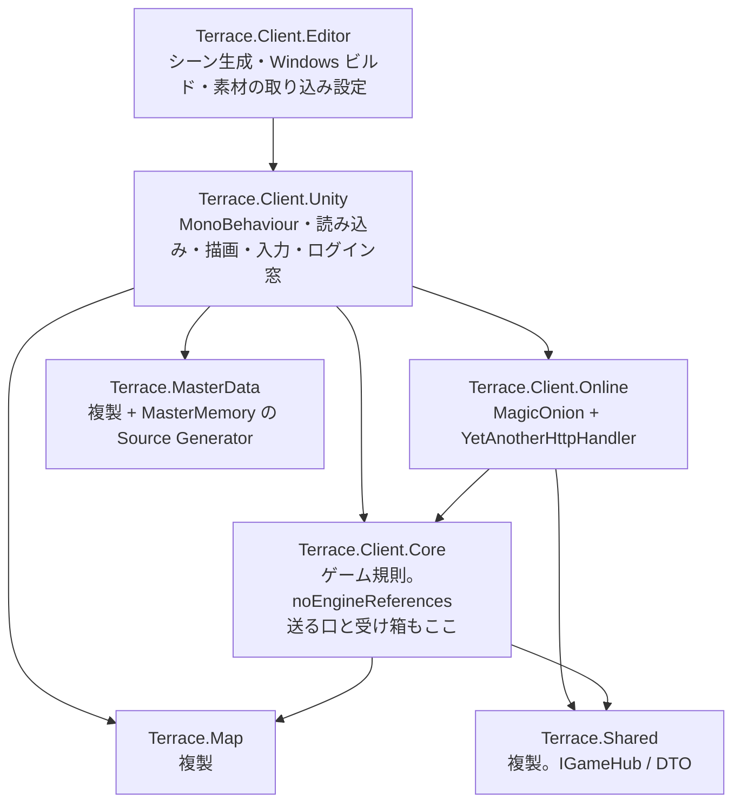

# システム全体

## 4 つのプロジェクト

| プロジェクト | 役目 | 形 | 言語・枠組み |
|---|---|---|---|
| Terrace.MasterData | CSV → master.bytes + manifest.json の変換 CLI(`masterdata-build`)。テーブル定義の正 | .NET CLI | net10.0。`src/Shared` は C# 9 |
| Terrace.Map | マップのデータ構造・問い合わせ・検証・JSON 入出力 | ライブラリ | net10.0 / C# 9 |
| Terrace.Server | ルーム(1 マップ = 1 ルーム)を持つゲームサーバーと、動作確認用のテストクライアント | ASP.NET Core + MagicOnion 7.10 | net10.0。`Terrace.Shared` は netstandard2.1 / C# 9 |
| Terrace.Client | 遊ぶためのクライアント | Unity 6000.3.6f1 | C# 9(Unity) |

## 依存とコードの配り方

| 共有物 | Server への渡し方 | Client への渡し方 |
|---|---|---|
| Map のコード | `ProjectReference`(兄弟のプロジェクトを直接参照) | `sync-shared.ps1` で `Assets/Terrace/Shared/Map/` へ複製。`MapSerializer.cs` は System.Text.Json に依存するので除く |
| MasterData のテーブル定義 | `ProjectReference` で Builder ごと参照 | `sync-shared.ps1` で `Assets/Terrace/Shared/MasterData/Tables/` へ複製 |
| master.bytes | 起動時に `content/master.bytes` を読む。無ければ `content/csv` を Builder のパイプラインで組み立てる | `sync-shared.ps1` が `masterdata-build` を実行し `StreamingAssets/master.bytes` と `master.manifest.json` を置く |
| マップ JSON | ビルド時に `Terrace.Map/maps/*.json` を `content/maps/` へ複製 | `sync-shared.ps1` で `StreamingAssets/maps/` へ複製(正の置き場は [ADR 0006](../decisions/0006-map-json-source-of-truth.md)) |
| 通信の定義(Terrace.Shared) | `ProjectReference` | `sync-shared.ps1` で `Assets/Terrace/Shared/Protocol/` へ複製。MagicOnion.Abstractions と MessagePack は NuGet |

## Client の中の依存

上の層は下の層を知り、下は上を知らない。

Client の外部パッケージは 2 系統で入れる。NuGet(MagicOnion.Client と依存一式、MasterMemory、MessagePack)は NuGetForUnity で `Assets/packages.config` から復元する。復元は依存を辿らないので、依存もすべて `packages.config` に並べる。UPM(YetAnotherHttpHandler、Multiplayer Play Mode など)は `Packages/manifest.json`。

詳しい流れは `Terrace.Client/ARCHITECTURE.md`。

## 実行時の姿

| 構成 | 内容 |
|---|---|
| Client(ひとり) | `GameSimulation` と係(`~System`)が Core の中で全部を回す。マップは起動時に全部読み、マップ ID で引く |
| Client(オンライン) | ログイン窓で選ぶ。自分の動きは Client、敵と落とし物は Server([authority.md](authority.md))。切断されたらひとりに切り替わる |
| Server | gRPC(MagicOnion、h2c)を `GrpcPort`、状態確認の HTTP/1.1 を `HttpPort` で待つ(`TerraceServerOptions`、`appsettings.json`)。`RoomTickService` が一定間隔で全ルームを進める |
| TestClient | コンソールから Server に繋ぎ、ログイン・参加・移動・攻撃を試す |
| Client と Server | Client は YetAnotherHttpHandler で h2c に繋ぐ。別の PC から繋ぐときは Server の `TerraceServerOptions.ListenAnyIP` を有効にする |

## マスタの版の一致

manifest.json の `sha256` を Client と Server で比べれば、同じマスタを使っているか確かめられる。Client は読み込み時に値を持ち、Server は状態確認の `GET /` に出すが、接続時に突き合わせる仕組みはまだ無い。

## 関連

- 権威の分担: [authority.md](authority.md)
- 同期の手順: [../guides/sync.md](../guides/sync.md)
- 判断の記録: [ADR 0004](../decisions/0004-share-code-by-copy-csharp9.md)
