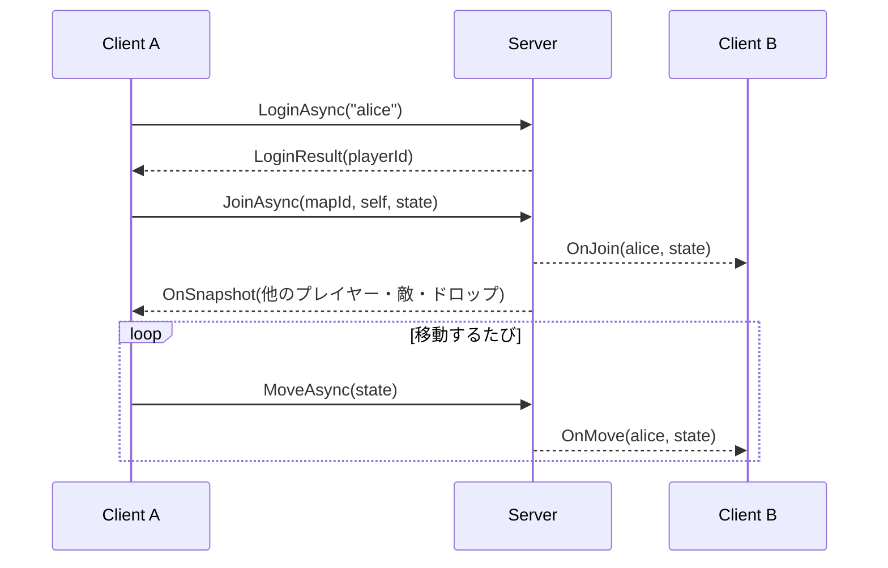
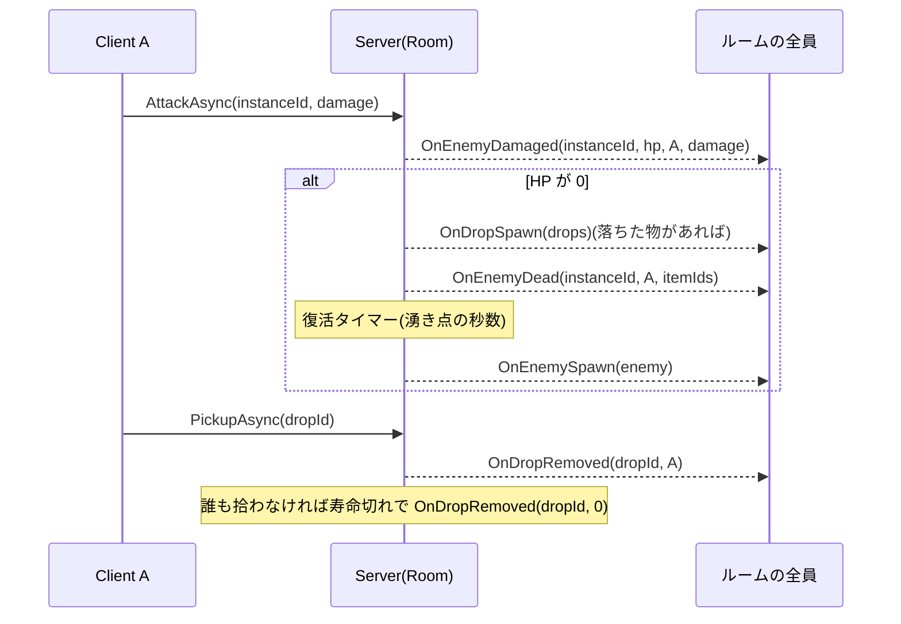
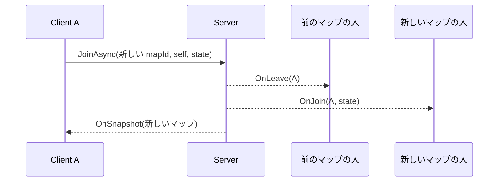

# 通信

メソッドと DTO の正は `Terrace.Server/src/Terrace.Shared/`。ここには約束ごとと流れを書く。

## 経路

- MagicOnion 7.10(gRPC)、シリアライザは MessagePack
- TLS なしの HTTP/2(h2c)。ポートは `TerraceServerOptions.GrpcPort`(既定は `appsettings.json`)
- 状態確認用に HTTP/1.1 のポート(`HttpPort`)で `GET /` が接続先・読み込んだマップとマスタ・ルームの状況を JSON で返す
- Unity からは YetAnotherHttpHandler(`Http2Only`)で繋ぐ(`MagicOnionConnection`)。テストクライアントは .NET の既定のハンドラ
- 認証・暗号化なし。すべてインメモリ

## Unary: `IAccountService`

| メソッド | 動き |
|---|---|
| `LoginAsync(name)` → `LoginResult` | ログインのたびに新しい `PlayerId` を発行する。名前は表示用(空なら `guest`、長すぎれば切る)。キャラクターは最初のマップにいる |

## StreamingHub: `IGameHub`(Client → Server)

1 接続 = 1 プレイヤー。参加前(`JoinAsync` 前)の呼び出しは無視される。

| メソッド | Server の動き | 届く通知 |
|---|---|---|
| `JoinAsync(mapId, self, state)` | すでにどこかのルームにいれば先に退出。ルームが無ければ作る。`state` の位置で参加 | 本人に `OnSnapshot`、他の人に `OnJoin` |
| `LeaveAsync()` | 退出。ルームが空になれば破棄 | 他の人に `OnLeave` |
| `MoveAsync(state)` | `IMoveValidator` を通れば位置を保持 | 他の人に `OnMove` |
| `AttackAsync(enemyInstanceId, damage)` | 敵の HP を減らす。0 なら死亡・ドロップ抽選・復活タイマー | 全員に `OnEnemyDamaged`、倒したら `OnDropSpawn`(落ちた物があれば)→ `OnEnemyDead` |
| `PickupAsync(dropId)` | まだ落ちていれば取り除く(早い者勝ち) | 全員に `OnDropRemoved(dropId, playerId)` |

切断されると自動で退出する。

## Receiver: `IGameHubReceiver`(Server → Client)

| 通知 | いつ | 誰に |
|---|---|---|
| `OnSnapshot(snapshot)` | 参加した直後 | 本人だけ |
| `OnJoin(player, state)` | 誰かが参加した | 本人以外 |
| `OnLeave(playerId)` | 誰かが退出・切断した | 本人以外 |
| `OnMove(playerId, state)` | 誰かの移動が受け入れられた | 本人以外 |
| `OnEnemySpawn(enemy)` | 敵が復活した(最初に湧いた分は Snapshot に含む) | 全員 |
| `OnEnemyDamaged(instanceId, hp, attackerPlayerId, damage)` | 攻撃が当たった | 全員 |
| `OnEnemyDead(instanceId, killerPlayerId, droppedItemIds)` | 敵が死亡した | 全員 |
| `OnEnemyMove(enemies[])` | 一定間隔(`Room.EnemyMoveBroadcastInterval`)。動く生きた敵の位置。プレイヤーがいるときだけ | 全員 |
| `OnDropSpawn(drops[])` | 敵がアイテムを落とした | 全員 |
| `OnDropRemoved(dropId, playerId)` | 拾われた(`playerId`)/ 寿命切れ(`0`) | 全員 |

「全員」「本人以外」はそのルーム(マップ)の参加者。配信グループは mapId ごと、キーは `PlayerId`。

## DTO

| DTO | 中身 |
|---|---|
| `PlayerInfo` | `PlayerId`、`Name` |
| `CharacterInfo` / `LoginResult` | キャラクター(名前・レベル・マップ・位置)とプレイヤー ID |
| `MoveState` | 座標・速度・向き(`Facing`)・動作(`MotionState`: Stand / Walk / Jump / Ladder / Crouch / Attack / Dead) |
| `EnemyState` | インスタンス ID・敵 ID・位置・HP・最大 HP・死亡・向き |
| `EnemyMoveState` | インスタンス ID・位置・向き |
| `DropState` | ドロップ ID・アイテム ID・位置 |
| `RoomSnapshot` / `PlayerSnapshot` | マップ ID、自分以外のプレイヤー、敵、ドロップ |

## 流れ

### ログインから参加、移動の中継

### 攻撃から復活まで

### マップ移動

## 互換の決まり

- `Terrace.Shared` は netstandard2.1 / C# 9(Unity からも同じソースを使うため)
- DTO の `[Key(n)]` は付け替えない・再利用しない。足すときは末尾の次の番号にする
- メソッドや Receiver を変えたら、Server(`GameHub`、`GroupRoomEventSink`、`IRoomEventSink`、テストの記録用 Sink)とテストクライアント(`Terrace.TestClient`)を合わせて直す
- IL2CPP 向けには MessagePack と MagicOnion のコード生成が別途要る。今の Unity Client は MagicOnion の動的生成を使う(エディタと Mono ビルドでだけ動く)
- 変えたら Client にも写す(`Terrace.Client/tools/sync-shared.ps1`)。Client の受け箱 `OnlineInbox` と、通知を反映する `OnlineSession`(敵と落とし物は `RoomMirror`)も合わせる

## Client での受け取り方

- 通知は `OnlineInbox` に積むだけにして、`GameSimulation.Step` の頭でメインスレッドから古い順に反映する(`OnlineSession.Pump`)
- `JoinAsync` を送ったあと、そのマップの `OnSnapshot` が届くまでは他の通知を捨てる(マップ移動の直後に前のマップの通知が遅れて届くため)。`OnSnapshot` の `MapId` が今のマップと違えば、それも捨てる
- 自分自身の `OnJoin` / `OnMove` は数えない
- `OnEnemyDead` は、すでに死んでいる敵については何もしない(重ねて届いても報酬は 1 回)
- 移動は毎フレームは送らない。いつ送るかは `MoveSender` が決める(状態や向きが変わったらすぐ、位置だけなら間隔を空けて、止まっていても時々)
- 切断(`WaitForDisconnect` の完了、送信の失敗)は受け箱に印を付け、次の `Step` でオフラインに切り替える
