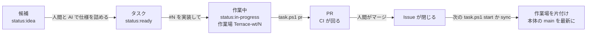

# タスクの流れ(候補 → タスク → PR → マージ)

複数の AI セッションに並列で実装させ、人間は PR をマージするだけで進めるための手順。主な読み手は AI。人間向けの要約は [OVERVIEW.md](../OVERVIEW.md) の「開発の進め方」。判断の理由は [ADR 0010](../decisions/0010-issue-driven-parallel-tasks.md)。

## 全体

| 段 | 誰が | 印(ラベル) | 道具 |
|---|---|---|---|
| 候補を出す | 人間(Issue の「候補」フォーム、または会話) | `status:idea` | GitHub |
| 仕様を詰めてタスクにする | AI と人間の会話 | `status:ready` | `gh issue` |
| 着手する | AI | `status:in-progress` | `pwsh tools/task.ps1 start N` |
| 実装・検証・PR | AI | | `pwsh tools/task.ps1 verify` / `pr` |
| レビューとマージ | 人間だけ | Issue が閉じる | GitHub |
| 片付けと本体の更新 | AI(次の `start` で自動。すぐなら頼まれたとき) | | `pwsh tools/task.ps1 sync` |

ほかのラベル: `status:blocked`(先に済ますタスクや判断を待つ)、`area:client` / `area:server` / `area:map` / `area:masterdata` / `area:docs` / `area:tools`(触るプロジェクト)。

## 候補をタスクにする

「#N をタスクにして」「この案を詰めたい」と頼まれたときの手順。

1. `gh issue view N` で候補を読む。関係する `docs/spec/`・`docs/architecture/`・コードを読む
2. 決めるべきことを人間に聞く。選択肢とお勧めを添える。推測で埋めない
3. 下の「タスクの書き方」に沿って本文を作り、人間に見せて了承を得る
4. 候補の Issue をそのまま書き直す: 題を `[task] ...` に、本文をタスクの形に、ラベルを `status:idea` から `status:ready` と `area:*` に替える(`gh issue edit N --title ... --body-file ... --add-label ... --remove-label status:idea`)。大きければ複数のタスク Issue に割り、候補からリンクして閉じる

## タスクの書き方

フォームは `.github/ISSUE_TEMPLATE/task.yml`。AI はこの Issue だけを読んで実装するので、書いていないことは「決めていない」として扱われる。

- **1 タスク = 1 PR。** 人間が 1 回で読める大きさにする。迷ったら割る
- **受け入れ条件はテストで確かめられる形にする。** 「Slime に 3 回当てると倒れる」のように。見た目の確認だけが要るものは、スクリーンショットを求める
- **触るプロジェクトと場所を書く。** 並列にしてよいかは、ここで決まる。下の「混みやすい所」を触るなら必ず書く
- **やらないことを書く。** 広がりすぎを防ぐ
- **順番があるなら「先に済ますタスク」に番号を書く。** その間は `status:blocked` にしておいてよい
- 数値は書かない。どの設定クラスのどのプロパティで持つかだけを書く([CLAUDE.md](../../CLAUDE.md) の文書の決まり)

## 「#N を実装して」と頼まれたら

本体(`Terrace/`)のフォルダで始め、作業はすべてタスクの作業場で行う。

1. **読む。** `gh issue view N`。`status:ready` でない、先に済ますタスクが閉じていない、仕様が足りない、のどれかなら作業を始めず、Issue にコメントして人間に知らせる
2. **作業場を切る。** `pwsh tools/task.ps1 start N`。`../Terrace-wt/N` にブランチ `task/N` の作業場ができ、Issue に `status:in-progress` と着手のコメントが付く。以後はこの作業場の中だけで作業する
3. **実装する。** 触るプロジェクトの `CLAUDE.md` を読む。Issue の範囲の外を直したくなったら、直さずに PR の「見てほしい所」に書く(または別の候補 Issue を作る)
4. **文書を合わせる。** [CLAUDE.md](../../CLAUDE.md) の「コードを変えたら、次の文書を合わせて直す」に従う。ただし `docs/roadmap.md` は、タスクがそれを求めるときだけ直す(並列のタスクがぶつかりやすいため。進み具合は Issue が記録する)
5. **共有コードやマップ・CSV を変えたら写す。** `Terrace.Client` で `pwsh tools/sync-shared.ps1`。写しは同じコミットに入れる
6. **コミットする。** 1 つの PR に複数のコミットでよい。メッセージは日本語で、先頭に `#N` を付ける(例: `#12 ポーションを使えるようにする`)
7. **検証する。** 作業場の中で `pwsh tools/task.ps1 verify`。変えたプロジェクトに応じて、文書と複製の検査、dotnet test、Unity の EditMode と PlayMode(2 人接続まで)を回し、結果を `.task-verify.md` に書く。Unity が要らない変更なら `-SkipUnity`。終わったら `git status` を見る。Unity が書き換えたファイル(meta など)が出ていたら、タスクに関係するものだけをコミットし、関係ないものは `git restore` で戻すか、別のコミットに分けて理由を書く
8. **PR を作る。** `pwsh tools/task.ps1 pr`。main が進んでいれば先に載せ直し(rebase)、そのときは検証をやり直す。PR の本文には `Closes #N`、変更、検証結果が入る。「見てほしい所」は AI が自分で書き足す(`gh pr edit`)
9. **報告して止まる。** PR の URL と、人間が見るべき点を伝える。**マージはしない。main に直接 push しない**
10. **CI を見る。** PR で CI が落ちたら、同じ作業場で直してコミットし、`git push` する

## マージの後

人間は PR をマージするだけでよい。GitHub を見張る仕組みは無く、片付けは次に道具を使うときにまとめて行う。

- `pwsh tools/task.ps1 start N` は、最初に作業場ごとの PR の状態を GitHub に問い合わせ、マージ済みのものを片付け(作業場・ローカルとリモートのブランチ・`status:in-progress`)、本体の main を origin/main まで早送りしてから、新しい作業場を作る
- 「マージしたから片付けて」「main を最新にして」と頼まれたら、本体のフォルダで `pwsh tools/task.ps1 sync`。同じことを今すぐ行う
- 本体が main 以外を開いているときや、未コミットの変更があるときは、本体の更新はしない(fetch だけ)。未コミットの変更が残る作業場も消さない
- マージせずに閉じた PR の作業場は自動では消さない。`pwsh tools/task.ps1 finish N -Force` で消す

## 並列の決まり

- 1 セッション = 1 タスク = 1 作業場。ほかのタスクの作業場を触らない
- 試験用のポートは作業場ごとに分けてある(`.task.json` の `grpcPort` / `httpPort`)。`task.ps1 verify` はそれを使う
- Unity の Library は作業場ごとにできる。初回の検証は取り込みに数分かかり、ディスクも食う。Unity を同時に回すのは 2〜3 作業場までにする
- 同じ「混みやすい所」を触るタスクは、同時に `status:ready` にしないか、「先に済ますタスク」で順番を付ける

### 混みやすい所

| 所 | なぜ | 扱い |
|---|---|---|
| `Terrace.Server/src/Terrace.Shared/`(通信の定義)と、その Client の写し | Server・Client・文書が一斉に変わる | 1 度に 1 タスク |
| `Terrace.Client/Assets/Terrace/Runtime/Core/GameSimulation*.cs` | 多くの機能の入口 | 同時に触るなら順番を付ける |
| `Terrace.Client/Assets/Terrace/Runtime/Unity/GameBootstrap.cs` | 見た目の組み立ての入口 | 同上 |
| `Terrace.MasterData/samples/csv/` と `master.bytes` | `master.bytes` はバイナリでマージできない | 衝突したら CSV をマージしてから `sync-shared.ps1` で作り直す |
| `docs/roadmap.md`、`docs/architecture/authority.md` | どのタスクも触りたくなる | roadmap は求められたときだけ。authority は権威を変えるタスクだけ |

データや独立したファイルを足すタスク(新しいマップ・敵・アイテム・飾り・店の品揃え)は並列に向いている。

## 検証の分担

| どこで | 何を | いつ |
|---|---|---|
| GitHub Actions(`.github/workflows/ci.yml`) | dotnet test(MasterData・Map・Server・Client の Core)、文書の検査、Client の複製が元と同じか(`master.bytes` を含む)、サーバーを立ててテストクライアント 2 つで繋ぐ(server-e2e。Docker の像のサーバーでも同じことをする server-docker) | PR と main への push のたび |
| 作業場(`tools/task.ps1 verify`) | 上の一部 + Unity の EditMode と PlayMode(Unity の 2 人接続) | PR を作る前に AI が |
| 人間 | 手で遊んで確かめる(タスクが求めたときだけ) | マージの前 |

Unity の試験は GitHub では回さない(ライセンスが要るため)。PR の「検証」に貼られた結果で確かめる。

`verify` の結果は `ok` / `FAILED` / `BLOCKED` のどれか。サーバーの要る試験は、手元の dotnet でサーバーを立て、Windows の Smart App Control に止められたら Docker のコンテナで立て直す(出力に「Docker のコンテナ」と出る。[ADR 0011](../decisions/0011-server-in-docker.md))。`BLOCKED` は「この PC では一部を確かめられなかった」で、止められたうえに Docker も使えないときに出る。Docker Desktop が止まっているだけなら、起動してから `verify` をやり直す。`BLOCKED` のままでもサーバーの要らない試験(Unity の PlayMode の大半)は回り、サーバー側の 2 人接続は CI が確かめるが、Unity の 2 人接続は誰も確かめていない。通信やオンラインに関わるタスクなら、PR の「見てほしい所」にそう書く。

Client の Core(ゲーム規則)とその EditMode テストの大半は、Unity なしでも `Terrace.Client/tests/Terrace.Client.Core.Tests` で回る。Unity の API を使うテストだけが Unity でしか回らない。

## うまくいかないとき

| 症状 | 対処 |
|---|---|
| `task.ps1 pr` が載せ直しで衝突した | 作業場で `git rebase origin/main` を手で行い、衝突を解いて検証し直す。`master.bytes` の衝突は CSV を直してから `sync-shared.ps1` で作り直す |
| CI の「Client の複製」が落ちる | `Terrace.Client` で `pwsh tools/sync-shared.ps1` を実行してコミットする |
| 作業場の Unity がスクリプトの埋め込まれたシーンを作った | `ProjectSetup` が止めるようにしてある。Library を消して(作業場の `Terrace.Client/Library`)やり直す |
| 新しい DLL が `0x800711C7` で読めない | Windows の Smart App Control。サーバーの DLL(MagicOnion.Server.dll)は止められやすい。試験の道具はサーバーを Docker で立て直す。Docker も使えなければ `verify` は `BLOCKED` と記す。設定を変えるかは人間が決める([setup.md](setup.md) の「つまずきやすい所」) |
| Issue が `status:in-progress` のまま放置されている | 作業場があるか `pwsh tools/task.ps1 list` で確かめる。無ければラベルを外す |
| `sync` や `start` が「作業場のフォルダを消せませんでした」と出す | Unity でその作業場(`Terrace-wt/N/Terrace.Client`)を開いていれば閉じてから、`pwsh tools/task.ps1 sync` をやり直す |
