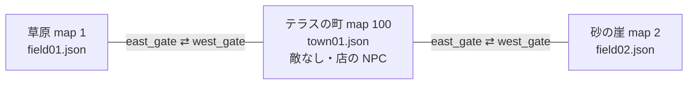

# マップの読み込み・ポータル・マップ移動・NPC

マップ JSON の形は [contracts/map-format.md](../contracts/map-format.md)。

## 読み込み

Client と Server は同じ規則で読む。

- マップのフォルダにある `*.json` をファイル名順に全部読み、マップ ID で引けるようにする
  - Client: `StreamingAssets/maps/`(`MapRegistry`)
  - Server: 実行ファイルの隣の `content/maps/`(`ServerContent`)
- ファイル名が `sample` で始まるものは読まない(Terrace.Map のテスト用サンプル)
- 同じマップ ID が複数あれば先に読んだ方を使い、警告を出す
- 読めないファイルは警告を出して飛ばす
- Server は読んだマップを `Validate()` し、問題を警告として出す

## 最初のマップ

- Client: `GameBootstrap` の `startMapId`(既定は町 = map 100)
- Server: ログイン結果のキャラクターは `AccountRegistry.StartMapId` のマップにいる。起動時には `TerraceServerOptions.InitialMapId` のルームを 1 つ作っておく(この 2 つは今食い違っている。[roadmap.md](../roadmap.md))

## 出現位置

マップに入ったとき(行き先のポータルが無いとき)と、復活するときに立つ位置。上から順に探す。

1. `kind` が `Spawn` のポータル(無ければ名前が `spawn` のポータル)
2. 最初のポータル
3. 最初の足場の中央
4. 原点

## ポータル

- ↑ を押したとき、`MotorConfig.PortalRange` 以内で一番近い、`kind` が `Portal` のポータルに入る([movement.md](movement.md))
- 行き先が同じマップ → 同じマップの `targetPortalName` のポータルへ瞬間移動
- 行き先が別のマップ → マップ移動(下)
- 行き先が見つからない → 「行き先はまだありません」のメッセージだけ出す

## マップ移動(Client)

1. 開いている店を閉じる
2. 行き先のマップの世界(敵とドロップ)を用意する。前に訪れていればそのときの続き。離れていた間、時間は止まっている
3. 行き先の `targetPortalName` のポータルに立つ。無ければ出現位置
4. 無敵を付ける
5. `MapChanged` を出し、Unity 層がマップ・敵・NPC・背景の見た目を作り直し、曲を替える(下の「BGM」)

オンラインでは、マップ移動のたびに着いた位置で `JoinAsync(新しい mapId, ...)` を呼ぶ。Server は前のルームから自動で退出させる([contracts/protocol.md](../contracts/protocol.md))。2 の世界は前の続きではなく空の世界を作り、スナップショットで埋める。前のマップの他のプレイヤーは消す。

着いた先のポータルに立った直後は、ポータルの待ち時間の間は入れない(↑ を押しっぱなしで引き返さないため)。

## 今あるマップの繋がり

内容の正は `Terrace.Map/maps/*.json`。この図は把握のためのもので、マップを足したら直す。

## NPC

- マウスの左クリックで、クリックした位置に重なる NPC に話しかける(Client の Unity 層が当てる)
- `kind` が `talk` → `greeting` をメッセージに出す(空なら「……」)
- `kind` が `shop` → 店を開く([economy-shop.md](economy-shop.md))
- `sprite` は見た目の名前。Client が素材を選ぶ。店の NPC は頭上にコインの看板を出す
- NPC に当たり判定は無く、移動を妨げない

## 飾り

- 見た目だけ。当たり判定なし
- `sprite` は Client の素材フォルダ(`Assets/Resources/Terrace/Art/Kenney/`)からの相対パス。例: `Buildings/houseBeige`
- `layer` が小さいほど奥に描く

## BGM

マップの `bgm` の曲を繰り返し流す。どの曲にするかはマップのデータが決める。Client の Unity 層(`AudioDirector`)が流し、Server は `bgm` を使わない。

- マップに入ったとき(開始時と `MapChanged`)に、そのマップの曲にする
- 移った先が同じ曲なら、頭から流し直さずに続ける。違う曲なら、前の曲を下げながら次の曲を上げて替える。曲が無い(`bgm` が空)マップでは、下げて止める。フェードの長さと音量は `AudioConfig.BgmFadeSeconds` と `AudioConfig.BgmVolume`
- オンラインとオフラインの切り替え(`WorldReplaced`)ではマップが変わらないので、曲はそのまま続く
- 曲のファイルが無ければ無音で続ける
- 消音は効果音と BGM の両方に効く。消音中も曲は進んでいて、戻すと続きから聞こえる

## テーマ

`theme` で地面のタイルと背景が変わる。Client が対応するのは `grass` / `stone` / `sand` / `castle` / `snow`。それ以外は `grass` と同じ見た目になる。
