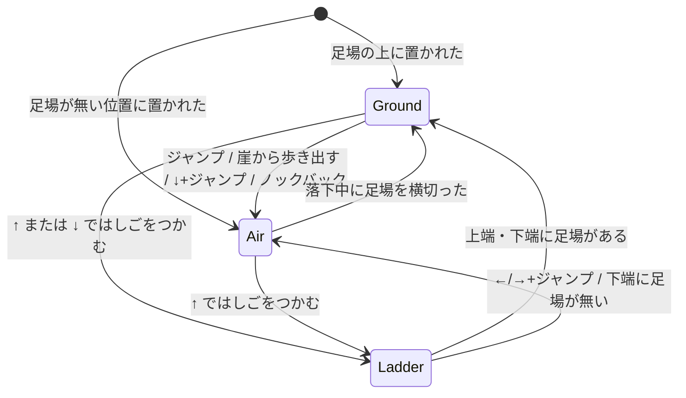

# 移動

物理エンジンは使わない。Terrace.Map の問い合わせ(`FindFootholdBelow`、`GetYAt`、`GetNext` など)だけで動かす。
数値はすべて `MotorConfig` のプロパティ(下では名前だけを書く)。

## メイプルストーリー準拠の割り切り

- 空中では横方向を変えられない(跳んだ瞬間の横速度を保つ)
- 崖の端から歩き出すと落ちる。壁には止まる
- ↓ + ジャンプで下の足場へ飛び降りる
- ↑ ではしごをつかむ・ポータルに入る。はしごの上で ←/→ + ジャンプで飛び降りる
- 攻撃中は歩けない。はしごの上では攻撃できない

## 入力

`InputFrame` は押しっぱなしの ←→↑↓ と、押した瞬間の Jump / Attack / Pickup を持つ。キーの割り当ては Client の Unity 層が決める。

## モードと遷移

## 1 ステップの順序

1. 攻撃硬直とポータルのクールダウンを減らす
2. Attack が押され、はしごの上でなく、硬直中でなければ攻撃を始める(`AttackLockSeconds` の硬直。地上なら横速度 0)
3. モードごとの処理(下)
4. ワールド境界で丸める

## 地上(Ground)

上から順に判定し、最初に当てはまったものだけを行う。

| 条件 | 動き |
|---|---|
| ↑ で、ポータルのクールダウンが切れていて、`PortalRange` 以内に入れるポータルがある | ポータルに入る(`EnteredPortal`)。クールダウン `PortalCooldownSeconds` |
| ↑ / ↓ で、`LadderGrabRange` 以内にはしごがあり、その向きへまだ動ける | はしごをつかむ |
| ジャンプ + ↓ で、今の足場以外に真下の足場がある | 飛び降りる。今の足場を着地対象から外して空中へ |
| ジャンプ(↓ なし)で、攻撃硬直中でない | 跳ぶ。横速度 = 入力の向き × `WalkSpeed`、縦速度 = `JumpVelocity` |
| ↓ | しゃがむ。止まる |
| 左右の入力なし、または攻撃硬直中 | 止まる |
| 左右の入力あり | 足場に沿って歩く(下) |

足場に沿って歩く:

- 行き先の X が今の足場の範囲内なら、X を進めて Y = 足場の `GetYAt(X)`(坂道を自動で追う)
- 範囲を出るなら `GetNext(足場, 向き)` を見る
  - 無い → 崖。そのまま X を進めて空中へ(縦速度 0)
  - 垂直な足場 → 壁。端で止まる
  - それ以外 → 次の足場へ乗り換える

## 空中(Air)

- ↑ で、はしごが `LadderGrabRange` 以内にあり、Y がはしごの区間内なら、つかむ
- 縦速度から `Gravity × dt` を引く(下限は `-TerminalVelocity`)。横速度は変えない
- 下向きに動いているとき、今の Y から新しい Y までの間に、新しい X で横切る足場のうち一番上のものに着地する。垂直な足場と、飛び降り中の元の足場は除く
- 飛び降り中の元の足場は、X が範囲を出るか、十分に下へ抜けたら、また着地対象に戻る

## はしご(Ladder)

- X ははしごの X に固定。速度 0
- ←/→ + ジャンプ → はしごを離れて跳ぶ(`LadderJumpVelocityX`、`LadderJumpVelocityY`)
- ↑ / ↓ → `ClimbSpeed` で上下する
  - 上端に着いた: そこに足場があれば乗る
  - 下端に着いた: 足場があれば乗る。無ければ空中へ

## ワールド境界

- X は `Left`〜`Right`、Y は `Top` 以下に丸める(ぶつかった向きの速度は 0)
- Y が `Bottom - FallDeathMargin` を下回ったら `FellOutOfWorld`(落死。[combat.md](combat.md))

## 瞬間移動(Teleport)

指定位置の真下の足場が近ければその上に立ち、無ければ空中から始まる。ポータルのクールダウンを始める(移った先のポータルにすぐ入り直さないため)。

## オンラインで送る形

Client は移動の結果を `MoveState`(座標・速度・向き・`MotionState`)として `MoveAsync` で送る(`OnlineSession.MoveStateOf`)。

`MotionState` は次の順に最初に当てはまるものにする。

| 条件 | MotionState |
|---|---|
| 死亡中 | `Dead` |
| はしご・ロープ | `Ladder` |
| 攻撃の硬直中(空中を含む) | `Attack` |
| 空中 | `Jump` |
| しゃがみ | `Crouch` |
| 横に動いている | `Walk` |
| それ以外 | `Stand` |

送る間隔は `MoveSender` が決める。状態か向きが変わったらすぐ(`UrgentInterval`)、位置だけ動いたら `MinInterval` ごと、何も変わらなくても `HeartbeatInterval` ごと。マップに入るとき(`JoinAsync`)はその位置で参加する。

## 他のプレイヤーの見え方

届いた `MoveState` をそのまま描くとカクつくので、表示位置は届いた位置へ毎フレーム寄せる(`RemotePlayer.FollowRate`)。歩いている間は速度で少し先読みする(`RemotePlayer.MaxLead`)。`RemotePlayer.SnapDistance` より離れていたら寄せずに瞬間移動する(復活・ポータル)。
